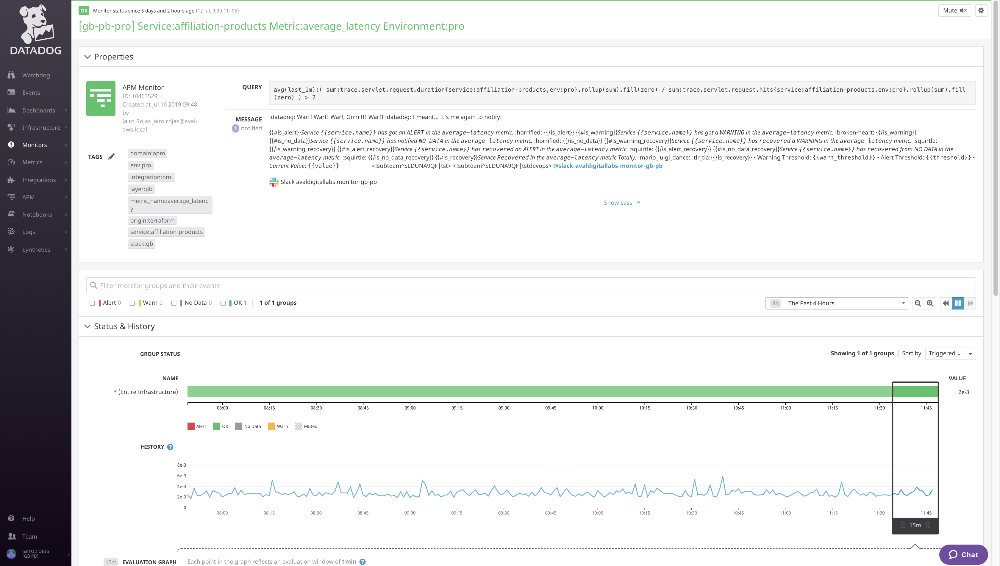

# devops-mod-dd-monitor-service

[](https://www.terraform.io)

>Terraform module responsible for the creation of DataDog resources related to Microservice Monitors.
>
>Developed with all :heart: in the world by ADL DevOps team

## Prerequisites

You will need the following things properly installed on your computer.

* [Git](http://git-scm.com/)
* [Terraform](https://www.terraform.io/downloads.html)

## Inputs

| Name | Description | Type | Default | Required |
|------|-------------|:----:|:-----:|:-----:|
| service_name | The name of the service in DataDog APM | string | n/a | yes |
| tags | A map of common tags to associate with monitor. | map | n/a | yes |
| custom_metrics | A list of maps with custom metrics values. | map | `{}` | No |
| locked | A bool indicating whether changes to to this monitor should be restricted to the creator or admins. | bool | `false` | No |
| notify_audit | A bool indicating whether tagged users will be notified on changes to this monitor.  | bool | `false` | No |
| timeout_h | The number of hours of the monitor not reporting data before it will automatically resolve from a triggered state. | number | `0` | No |
| notify_no_data | A bool indicating whether this monitor will notify when data stops reporting.  | bool | `true` | No |
| renotify_interval | The number of minutes after the last notification before a monitor will re-notify on the current status. It will only re-notify if it's not resolved. | number | `10` | No |

## Outputs

| Name | Description |
|------|-------------|
| monitor_id | The Identifiers of Service DataDog Monitors |

## Diagram



## Example usage

```terraform
# locals.tf
locals {
  common_tags = {
    stack  = "gb"
    layer  = "pb"
    env    = "pro"
    origin = "terraform"
  }
}

# main.tf
module "monitor_affiliation_products" {
  source         = "git@github.com:avaldigitallabs/devops-mod-dd-monitor-service.git?ref=v0.11-1"
  service_name   = "affiliation-products"
  tags           = merge(local.common_tags, { "integration" = "omi" })
  custom_metrics = { average_latency = [1.5, 1.2, 2, 1.8] }
}
```

## Contributing

If you find this repo useful here's how you can help:

1. Send a Merge Request with your awesome new features and bug fixes
2. Wait for a Coronita :beer: you deserve it.

## Further Reading / Useful Links

* [Terraform](https://www.terraform.io/docs/index.html)
* [Terraform modules](https://www.terraform.io/docs/modules/usage.html)
